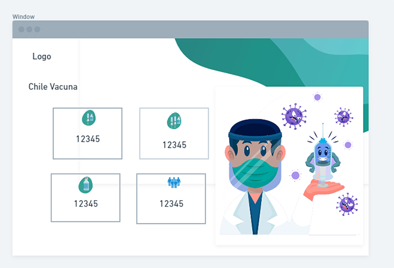

# Vaccination in Chile

Real data on the progress of vaccination in Chile
Data from minsal
Project made in Next.js, with css module with sass for the style

# Installation

```bash
npm install

npm run dev

```

# Live Demo

Try a live version at https://chile-vaccine.vercel.app/

# proposed UI

A page with the vaccination data.

<center></center>
